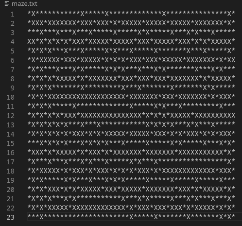
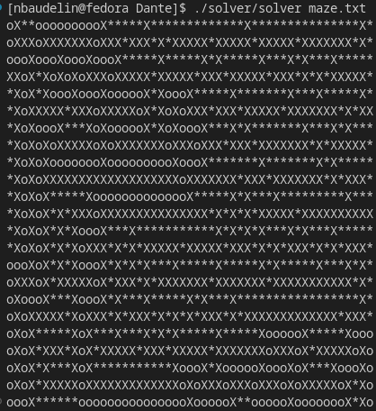

# DANTE
The Dante is a C algorithmic project that was done in groups of two over a period of three weeks. 
The goal is to create and solve perfect and imperfect mazes where a path is represented by '*', the walls by 'x' and the solution by 'o'. 
A perfect maze is a maze that has no loops or clusters. 

---
## Installation and usage

To use it, follow the instructions below: 
- Clone the repository by entering the following command in your terminal:

        git clone git@github.com:Patricklevyy/dante.git

- Once inside the cloned folder, compile the project by entering the command:

        make re

- Run the program by entering these commands:

    - In order to generate a perfect maze, you need to run the the program with this command:

            ./generator/generator x y [perfect]

            x           width of the maze
            y           height of the maze
            perfect     create a perfect maze [OPTIONAL]

    - In order to solve a maze, you need to run the program with this command:

            ./solver/solver maze.txt

            maze.txt    file with an unsolved maze

#### Example
I want to generate a perfect maze of width 51 and height 23 (and redirect the maze in a file for solve it). I must type the command:

        ./generator/generator 51 23 perfect > maze.txt

In the maze.txt file we get:

After that, I want to solve the maze. I must type the command:

        ./solver/solver maze.txt

The result will be:

Otherwise, you have many mazes in the maze_test folder.

---

## Contributors

[Nathan Baudelin](https://github.com/nathanbaudelin)
[Pierre Giordano](https://github.com/giordano-pierre)
